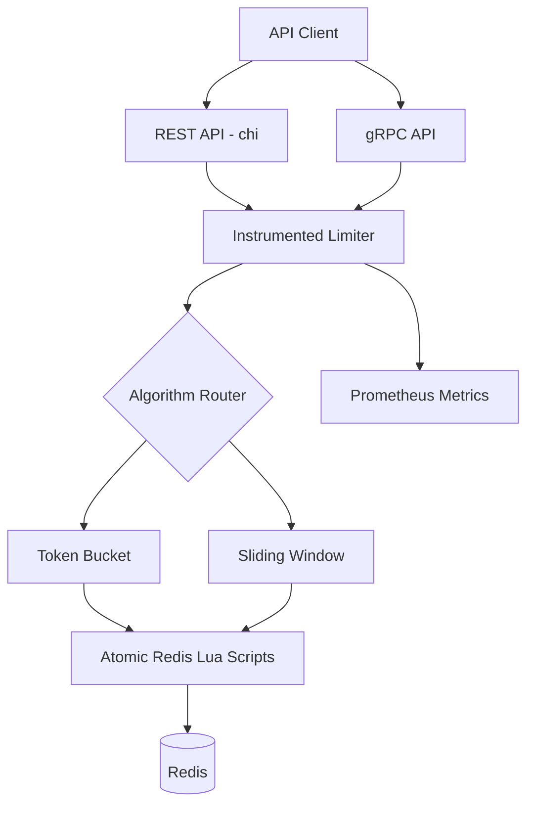

 <div align="center">

# ⚡ FluxGate

**High-Performance Distributed Rate-Limiting Service in Go**

Atomic Redis Lua Execution · REST & gRPC APIs · Prometheus Observability


</div>

## Overview

FluxGate is a distributed rate-limiting service built in Go to protect APIs from traffic spikes, abuse, and excessive requests. It uses Redis-backed state and atomic Lua scripts to enforce rate limits consistently across concurrent requests and service instances.

The service supports Token Bucket and Sliding Window algorithms, REST and gRPC interfaces, and Prometheus metrics for monitoring performance and request outcomes.

## Key Features

- **Distributed Rate Limiting:** Redis-backed shared state across service instances.
- **Atomic Execution:** Redis Lua scripts execute rate-limit decisions atomically.
- **Multiple Algorithms:** Token Bucket for controlled bursts and Sliding Window for rolling-window limits.
- **Dual API Interfaces:** REST HTTP and gRPC support.
- **Observability:** Prometheus metrics for request counts, decisions, errors, and latency.
- **Concurrency Safety:** Integration tests for simultaneous requests against shared client keys.
- **Reproducible Benchmarks:** Automated load testing with JSON benchmark reports.
- **Containerized Deployment:** Docker and Docker Compose support.

## Architecture



### Request Flow

1. A client sends a rate-limit request through REST or gRPC.
2. The handler forwards the request to the rate-limiting engine.
3. The configured algorithm evaluates the request using Redis Lua scripts.
4. Redis atomically updates the relevant state and returns the decision.
5. The service returns whether the request is allowed and, when applicable, a retry duration.
6. Prometheus metrics capture request outcomes and latency.

## Rate-Limiting Algorithms

| Algorithm | Data Structure | Behavior |
|---|---|---|
| Token Bucket | Redis Hash | Allows bursts up to a configured capacity and replenishes tokens over time. |
| Sliding Window | Redis Sorted Set | Enforces a request limit over a rolling time window. |

### Token Bucket

Each client has a token balance that replenishes at a configured rate. Requests consume tokens, while requests exceeding the available balance are rejected.

**Suitable for:** General-purpose APIs, bursty workloads, and smooth traffic control.

### Sliding Window

Each client's request timestamps are maintained within a rolling time window. Expired entries are removed before evaluating new requests.

**Suitable for:** Strict rolling-window limits, expensive API endpoints, and abuse prevention.

## Tech Stack

- **Language:** Go
- **Routing:** chi
- **Distributed State:** Redis
- **Atomic Operations:** Redis Lua scripts
- **API Protocols:** REST HTTP and gRPC
- **Serialization:** JSON and Protocol Buffers
- **Observability:** Prometheus
- **Infrastructure:** Docker and Docker Compose
- **Testing:** Go testing and race detector

## Quick Start

### Prerequisites

- Go 1.24 or later
- Docker and Docker Compose
- Git
- curl (for REST API testing)

### 1. Clone the Repository

```bash
git clone https://github.com/StardustEnigma/FluxGate.git
cd FluxGate
```

### 2. Start the Service

```bash
docker compose -f compose.yml up -d --build
```

Check the running containers:

```bash
docker compose -f compose.yml ps
```

### 3. Send a Rate-Limit Request

```bash
curl -i -X POST http://localhost:8080/rate-limit \
  -H 'Content-Type: application/json' \
  -d '{"clientId":"client-user-123"}'
```

An allowed response may look like:

```json
{
  "allowed": true,
  "retry_after": ""
}
```

A rejected response may look like:

```json
{
  "allowed": false,
  "retry_after": "450ms"
}
```

Actual responses and status codes depend on the service configuration and handler implementation.

### 4. Inspect Prometheus Metrics

```bash
curl -s http://localhost:8080/metrics | grep fluxgate
```

## Configuration

FluxGate supports configuration through CLI flags and environment variables.

### CLI Examples

Token Bucket:

```bash
go run . --algorithm token-bucket \
  --capacity 20 \
  --refill-rate 5
```

Sliding Window:

```bash
go run . --algorithm sliding-window \
  --limit 100 \
  --window 1m
```

### Environment Variables

| Variable | Purpose |
|---|---|
| `SERVER_MODE` | Select REST, gRPC, or both interfaces. |
| `PORT` | Configure the service port. |
| `REDIS_ADDR` | Redis host and port. |
| `REDIS_PASSWORD` | Redis authentication password. |
| `REDIS_TLS` | Enable TLS for remote Redis connections. |
| `ALGORITHM` | Select the rate-limiting algorithm. |
| `CAPACITY` | Configure Token Bucket capacity. |
| `REFILL_RATE` | Configure token replenishment rate. |
| `LIMIT` | Configure the Sliding Window request limit. |
| `WINDOW` | Configure the Sliding Window duration. |

Check the CLI and deployment configuration in the repository for supported defaults and precedence rules.

## Testing

Run the complete Go test suite:

```bash
go test -v ./...
```

Run tests with the race detector:

```bash
go test -race ./...
```

The test suite should cover algorithm behavior, request limits, client-key isolation, refill and expiry behavior, and concurrent requests. Exact coverage depends on the tests currently implemented in the repository.

## Benchmarking

FluxGate includes a benchmark harness for evaluating throughput, latency, and error rates under concurrent workloads.

Example commands:

```bash
ALGORITHM=token-bucket \
REQUESTS=50000 \
CONCURRENCY=200 \
./benchmark/run.sh
```

```bash
ALGORITHM=sliding-window \
LIMIT=10 \
WINDOW=60s \
REQUESTS=50000 \
CONCURRENCY=200 \
./benchmark/run.sh
```

Benchmark results can be used to compare the algorithms under identical workloads. Results depend on hardware, Redis configuration, connection pooling, network overhead, and concurrency.

### Reported Benchmark Results

The following figures are reported for a 50,000-request workload with 200 concurrent workers and 1,000 rotating client keys.

| Metric | Token Bucket | Sliding Window |
|---|---:|---:|
| Throughput | 22,537.74 req/s | 23,894.00 req/s |
| Average Latency | 8.58 ms | 8.07 ms |
| P50 Latency | 7.03 ms | 6.75 ms |
| P95 Latency | 11.36 ms | 11.17 ms |
| P99 Latency | 17.98 ms | 24.91 ms |
| Failed Requests | 0 | 0 |

*These are reported benchmark figures, not independently verified measurements. Retain them only if your benchmark artifacts support them and specify the test environment when publishing.*

## Project Structure

```text
FluxGate/
├── benchmark/        # Benchmark scripts and result artifacts
├── dto/              # Request and response structures
├── gen/              # Generated gRPC code
├── handler/          # REST and gRPC handlers
├── loadtest/         # Load-testing utilities
├── metrics/          # Prometheus instrumentation
├── model/            # Policies and domain models
├── proto/            # Protocol Buffer definitions
├── repository/       # Redis integration and Lua scripts
├── service/          # Rate-limiting logic and tests
├── Dockerfile        # Container image build
├── compose.yml       # Local service orchestration
├── go.mod            # Go dependencies
└── main.go           # Application entry point
```

## Security Considerations

- Never commit Redis credentials or secrets.
- Enable TLS when connecting to remote Redis instances.
- Restrict access to internal APIs and monitoring endpoints.
- Configure network access and authentication appropriately for production deployments.
- Set request timeouts and resource limits for resilient operation.

## Roadmap

- [x] Token Bucket algorithm
- [x] Sliding Window algorithm
- [x] REST API
- [x] gRPC interface
- [x] Redis-backed rate-limit state
- [x] Prometheus instrumentation
- [x] Automated benchmarking
- [ ] Fixed Window and Leaky Bucket algorithms
- [ ] Redis Cluster support
- [ ] Client SDKs for Go, Python, and Node.js

*Update the checkboxes to match the features actually implemented in the current repository.*

## License

This project is licensed under the MIT License. See [LICENSE](LICENSE) for details.
